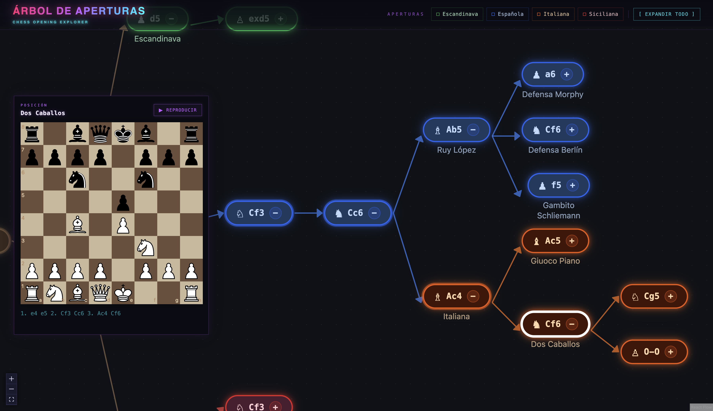

# Árbol de Aperturas de Ajedrez

[](https://app.netlify.com/projects/aperturas-de-ajedrez/deploys)

Explorador interactivo de aperturas de ajedrez. Visualiza las principales líneas de apertura como un árbol navegable.

**Demo:** [aperturas-de-ajedrez.netlify.app](https://aperturas-de-ajedrez.netlify.app/)



## Funcionalidades

- **Árbol navegable** — expande y colapsa ramas con los botones `+` / `−` de cada nodo
- **Filtros por apertura** — los botones del menú lateral (Escandinava, Española, Italiana, Siciliana, Francesa, Caro-Kann, Pirc, Alekhine, Gambito de Dama, Londres, India de Rey, Nimzo-India) muestran únicamente esa línea completa
- **Tablero de visualización** — al hacer clic en un nodo se muestra la posición resultante en el panel lateral; el botón **▶ Reproducir** anima los movimientos uno a uno.

## Desarrollo

```bash
npm install
npm run dev      # http://localhost:5173
npm run build
npm run lint
```

## Stack

- [React 19](https://react.dev) + [Vite 5](https://vite.dev)
- [@xyflow/react](https://reactflow.dev) — renderizado del grafo
- [chess.js](https://github.com/jhlywa/chess.js) — validación de movimientos y generación de FEN
- [react-chessboard](https://github.com/Clariity/react-chessboard) v5 — visualización del tablero
- [Tailwind CSS v4](https://tailwindcss.com)
- [@radix-ui/react-tooltip](https://www.radix-ui.com/primitives/docs/components/tooltip) — tooltips accesibles
