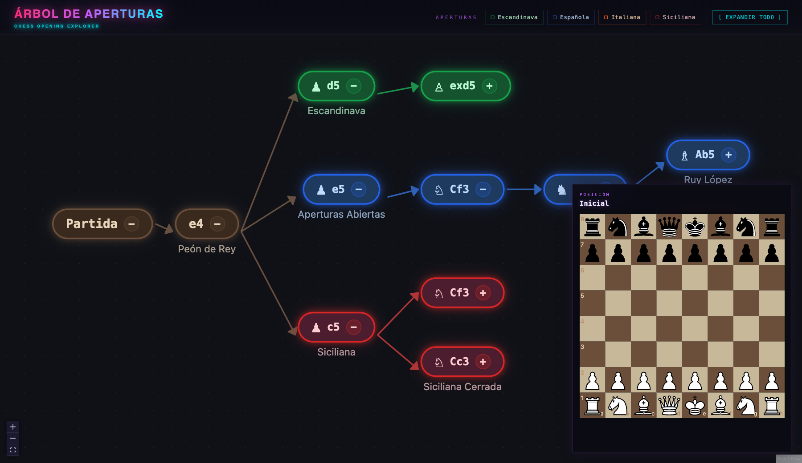
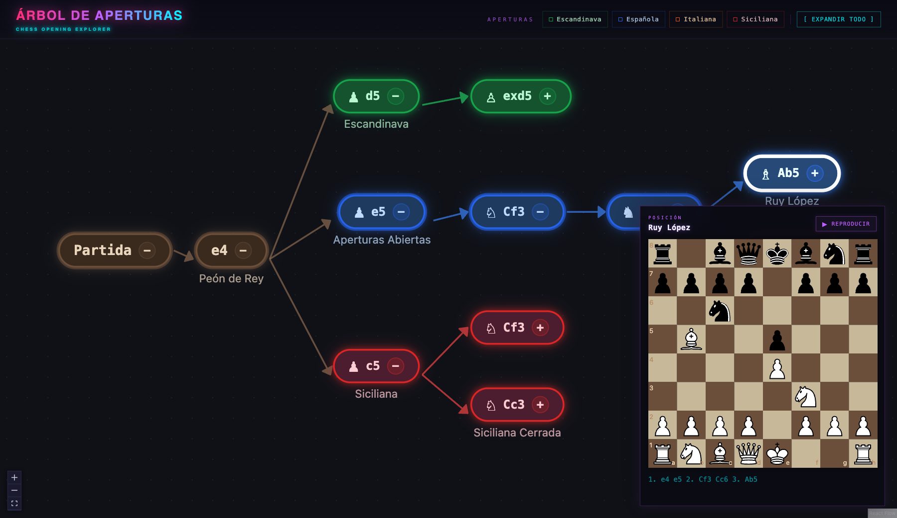

# Árbol de Aperturas de Ajedrez

Explorador interactivo de aperturas de ajedrez con estética retro-neón. Visualiza las principales líneas de apertura como un árbol navegable, con tablero animado y notación en castellano.



## Funcionalidades

- **Árbol navegable** — expande y colapsa ramas con los botones `+` / `−` de cada nodo
- **Filtros por apertura** — los botones del menú superior (Escandinava, Española, Italiana, Siciliana) muestran únicamente esa línea completa
- **Tablero interactivo** — al hacer clic en un nodo se muestra la posición resultante en el panel lateral; el botón **▶ Reproducir** anima los movimientos uno a uno
- **Tooltips con anotaciones** — mantén el cursor sobre un nodo para ver la nota táctica/estratégica de ese movimiento
- **Panel arrastrable** — el tablero puede moverse libremente por la pantalla
- **Notación castellana** — C (caballo), D (dama), R (rey), T (torre), A (alfil)




## Aperturas incluidas

| Apertura       | ECO     | Líneas                                                       |
| -------------- | ------- | ------------------------------------------------------------ |
| Escandinava    | B01     | Recaptura con dama, con caballo (Moderna), Gambito Islandés  |
| Española       | C60–C99 | Morphy / Cerrada, Berlín, Cambio, Marshall, Schliemann       |
| Italiana       | C50–C59 | Giuoco Piano, Ataque Evans, Variante Húngara                 |
| Siciliana      | B20–B99 | Najdorf, Dragón, Scheveningen, Clásica, Kan/Taimanov, Cerrada|

## Desarrollo

```bash
npm install
npm run dev      # http://localhost:5173
npm run build
npm run lint
```

## Stack

- [React 19](https://react.dev) + [Vite 5](https://vite.dev)
- [@xyflow/react](https://reactflow.dev) — renderizado del grafo
- [chess.js](https://github.com/jhlywa/chess.js) — validación de movimientos y generación de FEN
- [react-chessboard](https://github.com/Clariity/react-chessboard) v5 — visualización del tablero
- [Tailwind CSS v4](https://tailwindcss.com)
- [@radix-ui/react-tooltip](https://www.radix-ui.com/primitives/docs/components/tooltip) — tooltips accesibles
